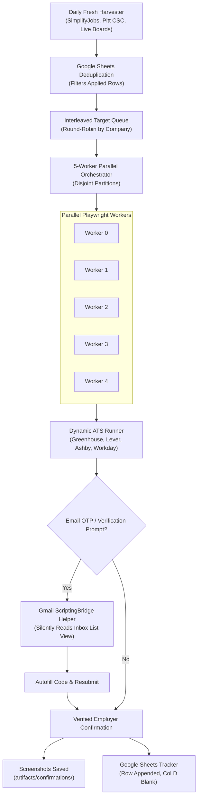

# AIJobAssistant: Autonomous SWE Application & Resume Copilot

[](https://www.python.org/)
[](https://playwright.dev/)
[](https://tectonic-typesetting.github.io/)
[](#supported-ats-platforms)

**AIJobAssistant** (`resume-tailor-swe`) is an autonomous, full-lifecycle agentic application engine designed for early-career Software Engineering, AI/ML, distributed systems, and technical roles.

It executes the end-to-end job application pipeline:
1. **Daily Fresh Role Discovery**: Scours live student/new-grad repositories and direct boards for newly opened positions.
2. **Dynamic LaTeX Tailoring**: Selects truthful archetypes and compiles single-page, ATS-compliant LaTeX resumes via Tectonic in <2ms.
3. **Multi-Worker Headless Execution**: Orchestrates 5 parallel Playwright workers with disjoint partitioning and round-robin company interleaving.
4. **Automated Gmail OTP Retries**: Silently captures 8-character Greenhouse security codes and Workday PINs without stealing OS window focus.
5. **Verified Confirmation & Sheet Sync**: Validates employer confirmation pages and auto-logs contiguous rows to Google Sheets.

---

## 🏗️ System Architecture



---

## ⚡ Key Capabilities

### 1. High-Concurrency Parallel Orchestrator
- Coordinates 5 parallel Playwright Chromium workers.
- **Disjoint Partitioning**: Worker $i$ processes jobs at index $k$ where $k \equiv i \pmod 5$, eliminating double submissions.
- **Slashed Dead-End Timeouts**: Unconfirmed or bot-blocked roles time out in **25s** (and **5s** on visible validation errors), keeping throughput high.
- **Round-Robin Company Interleaving**: Interleaves targets by company so workers never hit consecutive-company rate limits.

### 2. Autonomous Gmail Verification Code Bypass
- When Greenhouse or Workday prompts for a verification code (e.g. 8-character alphanumeric code), the engine never pauses or prompts the user.
- **Silent Retrieval**: Connects to the user's active Google Chrome session via macOS PyObjC ScriptingBridge with zero window activation and zero focus stealing.
- **Inbox DOM Navigation**: Automatically verifies the tab is on the `#inbox` list view, backing out of open threads to ensure rows are queryable.
- **Human Typing Emulation**: Types code character-by-character into `#security-input-0` through `#security-input-7` with randomized delays and re-submits.

### 3. Truth-Preserving LaTeX Resume Engine
- Selects the canonical baseline (`base_resume_latex.txt`, `research_resume_latex.txt`, `Java_resume_latex.txt`).
- Strictly preserves candidate truth: **zero metric invention, zero skill fabrication, zero fake scale**.
- Compiles via `tectonic` with strict 1-page budget and single-column ATS typography.

### 4. Real-Time Google Sheets Synchronization
- Connected via Google Cloud Service Account (`credentials.json` or Application Default Credentials) with file-locked atomic appends.
- **Column D (Salary)**: Kept strictly blank `""`.
- Caches applied URLs and `(company, role)` pairs locally (`/tmp/applied_sheet_records.json`, 300s TTL) to eliminate Sheets API quota exhaustion.

---

## ⚙️ Automated Setup & Resume PDF Onboarding

AIJobAssistant is completely self-building. Instead of manually editing configuration files, you can simply point the initialization engine to your existing **Resume PDF**:

```bash
python init_setup.py --resume-pdf /path/to/your/resume.pdf
```

The engine automatically parses your resume and extracts:
- **Candidate Contact**: Full Name, Email, Phone Number, City/State location.
- **Education**: School / University, Degree, Major, GPA, and Graduation Date.
- **Online Profiles**: LinkedIn, GitHub, and Portfolio URLs.
- **Technical Focus**: Primary programming language and technical skill set.

From that single PDF, it automatically builds:
1. **`config.json`**: Ground truth for all application form fillers, pointing directly to your resume PDF.
2. **`references/application_profile.md`**: Pre-filled with your confirmed facts and ATS bubble preferences.
3. **`references/base_resume_latex.txt`**: Tailored baseline ATS resume.
4. **Runtime directories & tracking logs**: Creates all required directories and logs.

> [!TIP]
> **Using an AI Agent (Antigravity, Cursor, Claude Code, etc.)?**
> Simply drop your resume PDF into the chat or say:
> *"Here is my resume: `path/to/resume.pdf` — set up my job search profile."*
> The AI agent will parse your resume and build all necessary files on your machine in seconds!

---

## 📁 Repository Structure

```
.
├── init_setup.py                            # Automated candidate environment builder (from Resume PDF)
├── SKILL.md                                 # Skill definition & agent instruction manual
├── README.md                                # Repository documentation
├── INSTALL.md                               # Detailed installation & onboarding manual
├── .gitignore                               # Clean git ignore for credentials, PII, logs
│
├── application_engine/                      # Application execution engine
│   ├── parallel_orchestrator.py             # 5-worker parallel launcher
│   ├── batch_apply_multi_ats.py             # Unified Greenhouse/Lever/Ashby engine
│   ├── batch_apply_workday.py               # Autonomous Workday external portal runner
│   ├── batch_apply_ashby.py                 # Dedicated Ashby automation runner
│   ├── email_verification_helper.py         # Automated Gmail OTP fetcher via ScriptingBridge
│   ├── fetch_fresh_internships.py           # Daily fresh role discovery & scraper
│   ├── cv_mouse_fallback.py                 # OS physical click fallback for captchas
│   ├── fast_resume_selector.py              # Archetype resume selector (<2ms)
│   └── tailor_and_compile.py                # LaTeX tailoring & Tectonic compiler
│
├── references/                              # Reference guidelines & templates
│   ├── application_profile.template.md      # Template candidate profile & constraints
│   ├── sample_resume_latex.txt              # Sample ATS-compliant LaTeX resume
│   ├── engine_handoff_guide.md              # Operational guide for running the engine
│   ├── resume_rules.txt                     # Bullet formula & typography guidelines
│   └── latex_and_formatting_rules.txt       # ATS single-column LaTeX guidelines
│
├── scripts/                                 # CLI tools & skill helpers
│   ├── init_setup.py                        # Automated setup wizard mirror
│   ├── apply_playwright.py                  # Single-job runner
│   ├── apply_workday.py                     # Workday automation helper
│   ├── log_application.py                   # Atomic Google Sheets logger
│   └── sync_email_responses_to_sheet.py     # Email status sync (rejections, interviews)
│
└── skills/resume-tailor-swe/                # Packaged agent skill directory
```

---

## 📦 Installation & Setup in 3 Minutes

Setting up AIJobAssistant for your own job search is fast and automated:

1. **Clone the repository**:
   ```bash
   git clone https://github.com/ariqserazi/AIJobAssistant.git
   cd AIJobAssistant
   ```
2. **Install requirements**:
   ```bash
   pip install -r requirements.txt
   playwright install chromium
   ```
3. **Build your environment from your Resume PDF**:
   ```bash
   python init_setup.py --resume-pdf /path/to/your/resume.pdf
   ```
   *(Or run `python init_setup.py` for interactive prompts, or ask your AI agent in chat).*

For complete details, see [INSTALL.md](INSTALL.md).

---

## 🚀 Quick Start & Usage

### 1. Install Dependencies
```bash
pip install playwright gspread google-auth pyautogui opencv-python certifi
playwright install chromium
```

### 2. Discover Fresh Roles Daily
Scour live repositories and build a fresh, deduplicated queue:
```bash
python3 application_engine/fetch_fresh_internships.py
```

### 3. Launch the 5-Worker Parallel Engine
Run 5 headless workers in parallel:
```bash
python3 -u application_engine/parallel_orchestrator.py 500 path/to/queue.json
```

### 4. Monitor Live Progress
```bash
for i in {0..4}; do echo "=== WORKER $i ==="; tail -n 5 scratch/parallel_logs/worker_$i.log; done
```

### 5. Apply to Workday Roles
```bash
python3 scripts/apply_workday.py
```

---

## 📜 License
MIT License.
